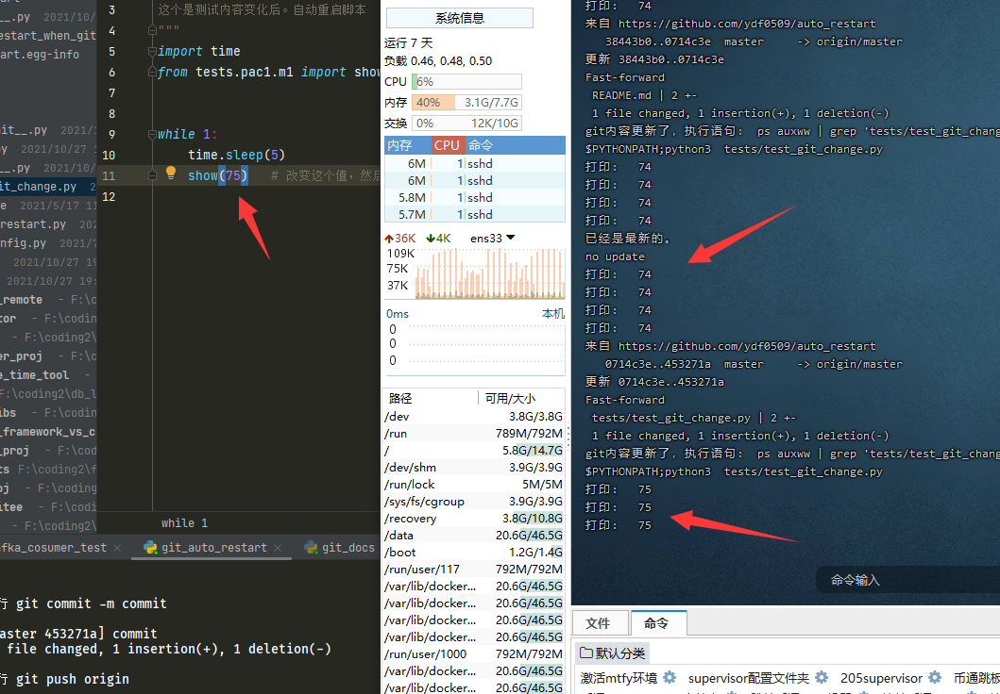

# 1 安装 pip install auto_restart


# 2  用途说明

当检测到git内容发生变化后，自动重启部署，是冷部署不是热部署。

建议在开发环境开发好后，代码推到测试分支，生产环境别用这种自动重启的方式。

建议吧git先切换到一个比较稳定的分支，你代码修改好后合并到这个稳定的分支。


# 3 用法
建议安装screen, apt-get install screen，(也可以不安装这个screen，使用nohup启动脚本了那就需要)

在screen会话里面 ，运行以下命令举个例子:


auto_restart_tool -d /home/ydf/pycodes/auto_restart  -s  "python3  tests/test_git_change.py" -k tests/test_git_change.py

auto_restart_tool命令是pip install auto_restart后自动生成的，可以直接使用这条命令。

之后，只要当前分支的git内容有更新就会自动重启。


# 4 auto_restart_tool命令行参数说明
命令行传参说明
```python
parser.add_argument('-d', '--project_root_dir', type=str, required=True)  # 你的项目的根目录
parser.add_argument('-s', '--start_shell_str', type=str, required=True)   # 启动命令，
parser.add_argument('-k', '--kill_contain_str', type=str, required=True)   # 杀死老进程，当字符串包含这个时候就当做老进程杀死。
```


# 5  运行截图

在win10上当把show函数的值从74改成75，并把代码合并到git后，linux测试环境极其不用手动重启会自动检测git更新并重启服务。

